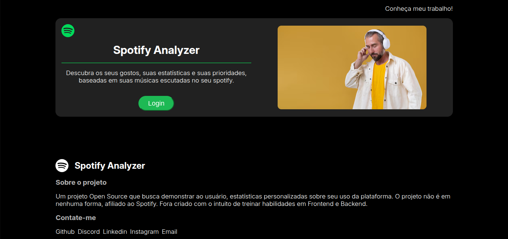
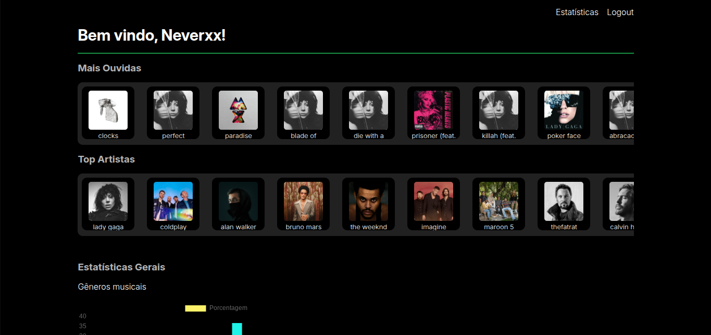
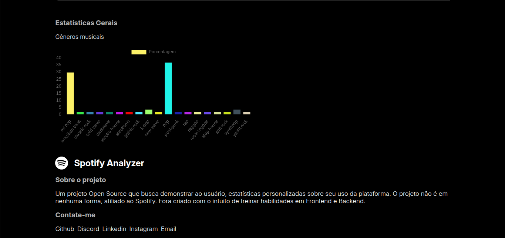

# Spotify-Analyzer
A Open Source web application that aims to analyse your spotify account and give statistics about your usage of the platform.

This project was built with Flask, HTML, CSS, Javascript and Chart.js.

OBS: Dues to spotify API limitations, only whitelisted users can acess these analysis, but you can check the preview in the preview section, with also images.

DISCLAIMER: THIS PROJECT IS NOT AFFILIATED WITH, OR IN ANY WAY OFFICIALY CONNECTED TO SPOTIFY. ALL LOGOS, TRADEMARKS AND BRAND NAMES ARE PROPERTY OF THEIR RESPECTIVE OWNERS. THIS PROJECT IS FOR EDUCATIONAL PURPOSE ONLY.

# Features

- Reponsive design with CSS Grid and Flexbox, usage of pseudoselectors, and variables
- Flask backend serving dynamic data along the project
- Chart.js for interactive charts of music genres, integrated with backend data with frontend API calls
- Login System implemented with Spotify api and Flask sessions
- Display the top artists and most listened tracks in homepage integrated to spotify API
- Design and palette inspired by spotify
- Usage of jinja2 templates with flask, aiming to reduce code

# Preview

# Images

## Login Screen

## Homepage

